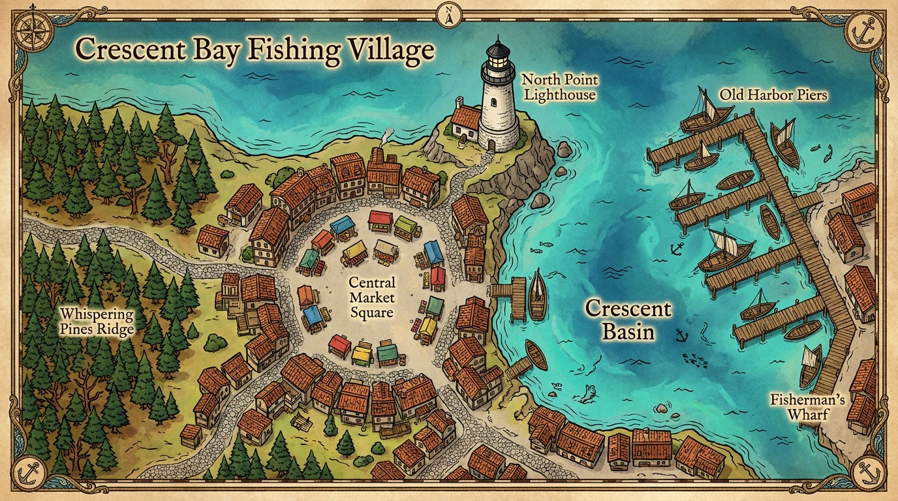

# An Illustrated World, From Map to Saved Places

openflipbook is a self-hosted experiment in exploring illustrated worlds. This guide is the first public read-only showcase; there is no public generation service to sign into.

The map above came from an actual openflipbook session. Its source and tap locations are recorded in the [click fixtures](../apps/modal-backend/tests/click_bench/fixtures/v1.json). It is not an image from the original Flipbook product.

## Walk Through the App

1. Start the [local stack](../README.md#quickstart). `make demo-mock` exercises the workflow with placeholders and no model charges; `make demo` uses your API keys and bills real generation.
2. Open `/play` and upload a map or describe a world. In World Mode, choose a mapped place to enter. Creating an unseen destination is a new generation, not recovered ground truth.
3. Open **Inspect places**. Set the canonical name, appearance description, identity lock, and reference crop. Renaming preserves the previous name as an alias. A metadata lock constrains future requests; it is not a guarantee of visual fidelity.
4. Return to a saved view. The app loads its existing image and node instead of asking a model to recreate it. This is the persistence guarantee, distinct from the quality of an unseen perspective.
5. Publish the session to the gallery, then open `/embed/<sessionId>`. The read-only viewer navigates existing nodes and offers a tour, without generation or animation calls. Publishing grants access to the session graph, so use only material intended to be public.

The embed publish gate is not a claim that all other session URLs are private. Session-content reads elsewhere remain open; do not put confidential material into a public deployment.

## Three Different Promises

| Behavior | What exists | What remains uncertain |
| --- | --- | --- |
| Saved-place persistence | Stored images, canonical metadata, references, and revisits | Storage availability and deployment configuration |
| Accurate new views | Reference-conditioned edits and critic receipts | Place, framing, labels, and style can drift; critics can miss failures |
| Animated arrival | Video conditioned on saved start/end images; replayable clips | Intermediate frames can invent geometry or change landmarks |

The [strict identity pilot](research/11-place-identity-pilot.md) exposed substantial generation failures. Strict generation and source-preserving OUTWARD remain opt-in. A smooth video cannot make a wrong destination correct.

## Evidence and Reproduction

- [Transition-video comparison](research/12-transition-video-pilot.md): the same three saved map/arrival pairs through H3 Max and LTX, with sampled frames, costs, and limitations.
- [Place identity contract](PLACE_IDENTITY.md): canonical anchors, locking, saved-view reuse, and strict rejection behavior.
- [Embedding](EMBEDDING.md): publish gate, oEmbed, and deployment recipes. Hosting is a separate decision, not required to read this guide.
- [Browser regression](../apps/web/e2e/embed.spec.ts): desktop/mobile marker alignment, enter/back, publish gating, tours, and zero model requests in the read-only viewer. These tests use mocked generation, not a visual-quality benchmark.
