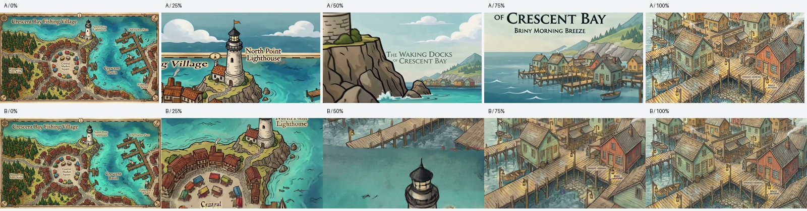
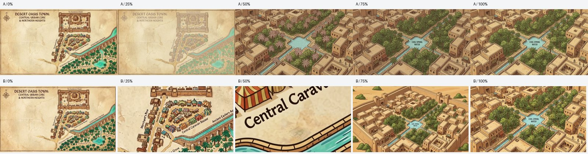
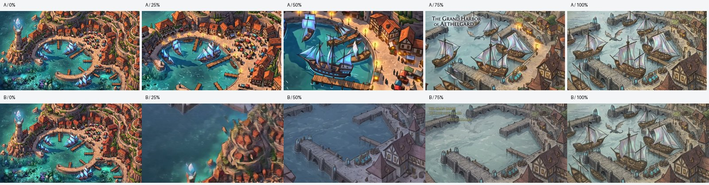

# H3 Max vs LTX: Saved-Frame Transition Pilot

Run: September 7, 2026 (America/Chicago; September 8 UTC).

**Result: H3 Max is a promising optional transition model, not a consistency fix or a new default.** Six clips completed with one submission each. Reservations total **$1.44 against a $2 cap**. A full cached rerun reused all six request IDs and left reservations unchanged.

## What We Compared

Three existing map/arrival pairs from the [place-identity pilot](11-place-identity-pilot.md). Both models received identical original image bytes, destination bytes, prompts, and a requested six-second duration. No new still images, paid judges, or rerolls were used.

| Model | Settings | Per-clip reservation | Observed end-to-end times |
| --- | --- | --- | --- |
| H3 Max | `minimax/h3-max/image-to-video`, 768P, balanced prompt expansion | $0.12 | 28.873s, 29.110s, 30.083s |
| LTX 2.3 Fast | `fal-ai/ltx-2.3/image-to-video/fast`, 1080p, 24fps | $0.36 | 75.202s, 53.839s, 59.456s |

The [live pricing API](https://fal.ai/docs/platform-apis/v1/models/pricing) returned $0.0125/second for H3's base resolution and $0.06/second for LTX. We reserved H3 at its selected 768P rate of $0.02/second. That launch rate expires September 14; the published post-promotion 768P rate is $0.08/second, or $0.48 for six seconds. Its present price advantage is temporary. [H3 endpoint pricing](https://fal.ai/models/minimax/h3-max/image-to-video), [LTX endpoint pricing](https://fal.ai/models/fal-ai/ltx-2.3/image-to-video/fast).

**Reservations are not an invoice.** Per-request billing reconciliation was unavailable with the configured key, so reported costs remain null in the receipts. The script does not reset reservations or interpret an unavailable billing record as a refund.

These are three sequential runs, not a latency benchmark. Timing includes uploads where needed, queueing, download, and frame extraction; H3 ran first for each pair, while LTX reused uploaded inputs. H3's provider-reported inference time was about 4.5 seconds, which is not its end-to-end latency. Returned files measured 6.592s for H3 and 6.042s for LTX despite both requests specifying six seconds.

## Frame Audit

Below are frames sampled near 0%, 25%, 50%, 75%, and 100% of each actual file. This is an assistant visual frame audit, not a blind human preference study or an exhaustive playback review. Raw machine receipts intentionally leave the automatic visual verdict `unreviewed`.

### Fishing Village: A = H3, B = LTX



H3 approaches the lighthouse, but the intermediate view becomes a flatter cartoon with map furniture still visible before it moves toward the docks. LTX also approaches the lighthouse, then changes the surrounding geometry into the destination's wooden piers. Both end near the supplied dock illustration. Neither proves a faithful lighthouse arrival: the supplied destination was already the wrong place.

### Oasis: A = LTX, B = H3



LTX's sampled transition fades between the map and the oasis scene rather than establishing a camera path. H3 visibly pushes into the map, but through the bazaar and its lettering instead of the named citadel, then changes to an isometric oasis. The destination mismatch predates the video. Neither earns a place-consistency pass.

### Harbor: A = H3, B = LTX



H3 moves into the harbor but shifts into a more saturated, cartoon-like register mid-flight. LTX replaces the shoreline with the destination's gray piers while the original city leaves the frame. Both approach the supplied harbor composition; neither lands on the named crystal lighthouse.

All six endpoints are visually recognizable as their supplied inputs, not verified pixel-identical copies. Compression, resampling, different resolutions, and H3 prompt expansion make this a comparison of two usable configurations, not an isolated test of base-model quality. H3's expanded prompts are retained so its additional scene invention can be inspected.

## Reproduce Without Accidental Spending

From `apps/modal-backend`, with the normal Python dependencies and FFmpeg installed:

```bash
# Offline preview; no credentials loaded, uploads, or API calls.
.venv/bin/python -m tests.video_transition_bench.runner

# Explicit paid run, capped at $2 in durable reservations.
H3_TRANSITION_PILOT=1 .venv/bin/python -m tests.video_transition_bench.runner --run

# Offline viewer and five-frame contact sheets from saved outputs.
.venv/bin/python -m tests.video_transition_bench.review
```

The original parent maps and frozen arrival JPEGs are in the repo. Raw MP4s, frame extracts, queue records, and `review.html` are generated under `tests/video_transition_bench/reports/` and ignored by git. Open `review.html` locally to compare the full clips with playback controls. Browser automation could not open that local-file URL under its security policy; the contact sheets were inspected directly instead.

Preserve `ledger.json` across retries and restarts. A process lock prevents concurrent pilots, reservations precede every submission, and raw queue POSTs have no automatic retries. Known jobs resume with GET requests. A failed or ambiguous submission retains its reservation and cannot automatically resubmit. Changed inputs/settings consume the same remaining budget; no production settings are changed. At higher future prices the runner reports skipped cells when the cap cannot fit them.

[Frozen machine receipts](12-transition-video-pilot.json) include input/output hashes, settings, request IDs, expanded prompts, file metadata, original timings, reservations, and unavailable billing fields.

## What Ships

- H3 Max support is available through `FAL_DESCENT_MODEL=minimax/h3-max/image-to-video`; LTX remains the default.
- Automatic descent, strict generation, and source-preserving OUTWARD retain their existing opt-in defaults.
- The read-only viewer now aligns markers with image pixels, handles cached-image hydration and loading failures, and is browser-tested on desktop/mobile with zero model calls during navigation.
- The next consistency experiment should fix **source-to-destination agreement before animation**, using correct place framing and canonical references. More convincing movement cannot repair a destination that was already wrong.
